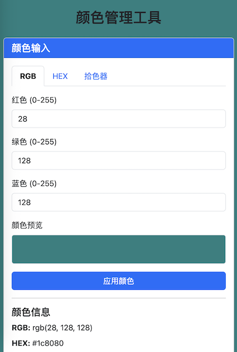

# ColorPal - 智能色彩管理工具



ColorPal 是一个响应式的网页应用，用于管理和组织颜色。它支持多种颜色输入格式，可进行颜色格式转换，并能将颜色分组管理以便快速访问。

## 功能特性

- **多种颜色输入方式**
  - RGB 数值输入 (0-255)
  - HEX 值输入 (支持带#或不带#)
  - 颜色选择器

- **颜色格式转换**
  - 显示颜色的 RGB、HEX 和十进制表示
  - 实时颜色预览

- **颜色管理**
  - 将颜色保存到命名分组
  - 编辑、删除和组织颜色
  - 按分组筛选颜色

- **便捷工具**
  - 一键复制颜色值
  - 快速选择分组
  - 响应式设计，适配各种设备

## 安装使用

无需安装！ColorPal 可直接在浏览器中运行。

1. 克隆本仓库：
   ```bash
   git clone https://github.com/swiftuihome/ColorPal.git
   ```
2. 在浏览器中打开 `index.html` 文件。

或使用在线演示：[演示链接](https://swiftuihome.github.io/ColorPal)

## 使用说明

1. **输入颜色**
   - 使用任意输入方式(RGB、HEX 或颜色选择器)
   - 点击"应用"按钮设置颜色

2. **保存到分组**
   - 输入分组名称或从现有分组中选择
   - 点击"添加"按钮保存颜色

3. **管理颜色**
   - 编辑颜色名称和分组
   - 删除单个颜色或清空所有
   - 使用分组筛选功能

4. **复制颜色值**
   - 点击颜色值旁边的复制图标，可将其复制到剪贴板

## 技术栈

- HTML5, CSS3
- JavaScript (ES6)
- [Bootstrap 5](https://getbootstrap.com/) - 响应式设计
- [Font Awesome](https://fontawesome.com/) - 图标库
- LocalStorage - 数据持久化存储

## 参与贡献

欢迎贡献代码！请按以下步骤操作：

1. Fork 本项目
2. 创建您的特性分支 (`git checkout -b feature/新特性`)
3. 提交您的修改 (`git commit -m '添加了新特性'`)
4. 推送分支 (`git push origin feature/新特性`)
5. 提交 Pull Request

## 开源协议

本项目采用 MIT 开源协议。详见 `LICENSE` 文件。

## 联系方式

swiftuix.com - [@您的Twitter](https://twitter.com/swiftuihome) - swiftuihome@qq.com

项目地址：[https://github.com/swiftuihome/ColorPal](https://github.com/swiftuihome/ColorPal)
